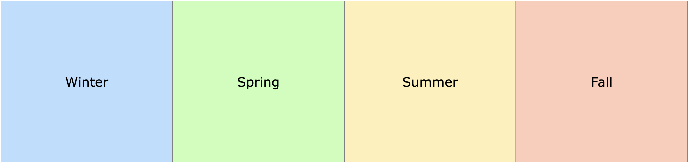
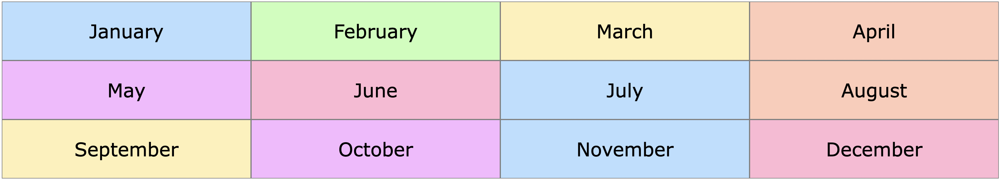
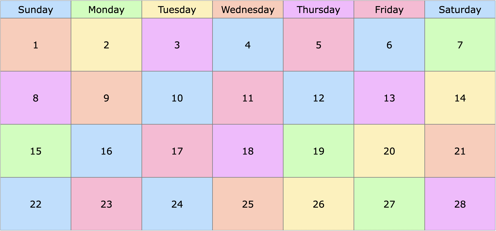
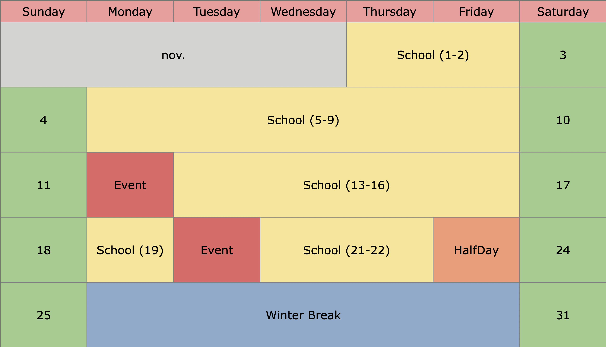
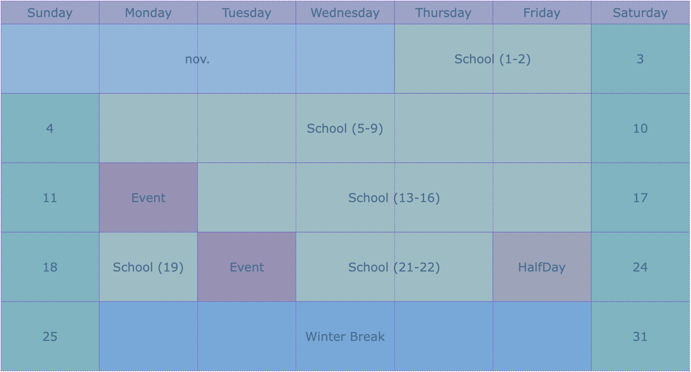
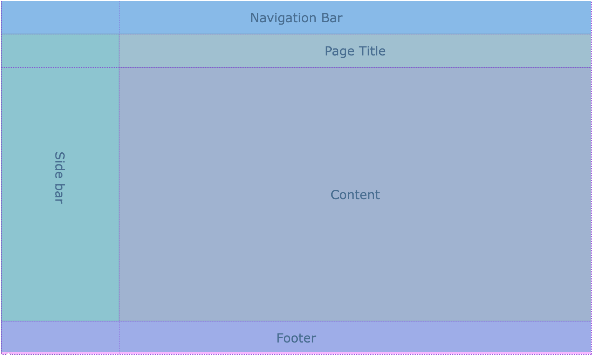
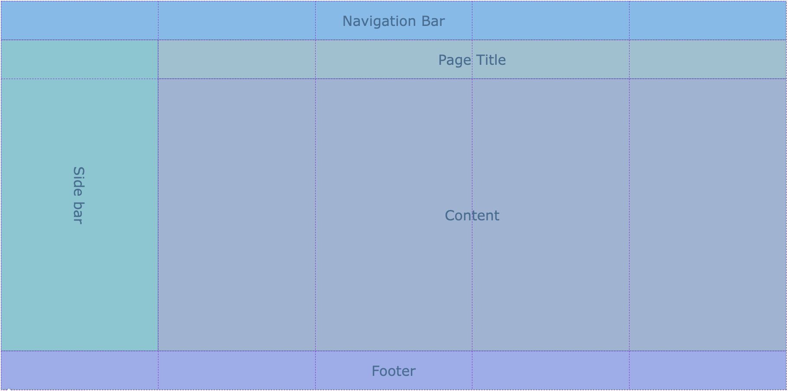
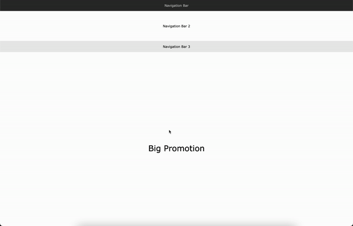

# Grid Interview

### Teacher Notes

This lab is a way for students to get some at bats at applying CSS Grid to pre-written HTML code. In the extension, students will have the opportunity to duplicate the general structure of a webpage. We find that Apple's website is a straight forward exemplar, but feel free to find other similar websites or allow students to use a website they prefer to recreate.

Especially for level 3 and harder, students will want to use the Dev Tools to visualize how Grid is being applied. For level 3 and 4, two mock up views are provided. One is used to illustrate the exemplar result, and the other is used to illustrate how the result should be conceptualized in order to incorporate Grid effectively.  Take some time to show students how to use the Dev Tools on their own computers to work through these problems. 

### Prompt

You are applying to work side by side a busy politician who will need a nicely organized website, and they want to make sure you know your stuff before giving you the job. They've given you a couple of challenges to test your competency.

**Directions**: Your task is to use Grid to style the CSS for each level matching the corresponding exemplar.

1. For this first layout, you'll want to focus on `grid-template-columns` and `grid-template-rows`. The end goal for this level is a simple row (at a height of `400px`) with four equal sized columns (each at `1fr`).

    _Mock Up 1_
    

2. Busy politicians rely heavily on calendars to organize their tasks. In this next section, you'll be using the same properties that you worked with in the last level, but you'll need to format it two-dimensionally:
   - For the first part organize the months of the year into 3 rows of 4. The width of each column should be evenly spaced (`1fr`), and the height of each row should be `100px`.
   - For the month of February, it should be formatted as 5 rows of 7 columns. The days themselves should be three times as large as the first row of day titles, and horizontally, all the columns should be equally sized.

    _Mock Up 2 Months_
    
    _Mock Up 2 "February"_
    

3. Things get quite a bit trickier for the month of December in level 3. You'll need to use `grid-column-start` and `grid-column-end` to specify how much space each section takes up horizontally. You could also use `span` or specific `column-line values` as seen in [this documentation](https://www.w3schools.com/cssref/pr_grid-column.asp) from w3schools. Either way, head into the `level_three.html` for this level so you can extract the ID needed for special styling. Notice that the first row of day titles are still smaller than the other rows. Use the same proportion (1:3) you used in level 2.

    _Mock Up 3_
    
    _Mock Up 3 - Dev Tools View_
    

4. Now that you proven your skills and have shown what's needed to format a quality calendar, it's time to demonstrate how you can format a webpage. For this level, there is actually 2 ways it can be done. Choose which ever method you're most comfortable with:
    - **Method 1**: use `grid-column` **and** `grid-row` to match the starter code to the image below. The "Navbar", "Page Title", and "Footer" sections are each `90px` in height, and the content section is `630px`. The "Side Bar" takes up 1/5 of the horizontal width. You can do this one of two ways as illustrated below. Choose the one that makes most sense to you for now.
    - **Method 2**: use `grid-template-areas` and `grid-area`. This method is a a bit trickier to understand, but once you learn it, it makes styling with Grid much easier. If you're interested check out [this video](https://youtu.be/qTGbWfEEnKI?t=319) for a quick tutorial.

    _Mock Up 4_
    
    _Mock Up 4 - Dev Tools View (Option 1: 2 Columns)_
    
    _Mock Up 4 - Dev Tools View (Option 2: 5 Columns)_
    

### Culturally Responsive Best Practice

Grid is commonly found in many websites. Have students find websites that they commonly go to for products that they have or have bought in the past including but not limited to: Nike, Playstation, Apple, Glossier, etc. Select websites that the students have provided, and use them to show examples of Grid. The goal will be to have students connect Grid to experiences or websites that they are personally familiar with.

### Extra Help?

Can't tell if my proportions are right! If you're having problems sizing things up, inspect your page. Right click on you page and click on inspect. When you hover over the portion you're working on, you should be able to see a _"grid"_ as indicated above that will show you whether or not you're on track. On top of that, be sure to go with the trial and error method.

What's the difference between using `fr` (**fr**action) and `px` (**p**i**x**els). In short, you want to use fraction for width of the page and pixels for length or height of the page. Later we will be looking at how your webpage can adjust based on screen size, and this best practice will make more sense. If you're itching to know now, check out [this resource](https://medium.com/swlh/css-units-which-ones-to-use-and-avoid-31e4ed461f9) for more information on the difference between `fr`, `px`, `%`, and more.

### Extensions

**Mild**:

- Go back to #4 and apply the proportional width in which ever way you haven't yet. If you did it in 2 uneven parts, now try it in 5 equal parts, and if you tried it in 5 equal parts, try completing it in just 2 uneven parts.

**Medium**

- Okay. The politician now wants a website set up similar to [Apple's website](https://www.apple.com/mac/). Here all your skills learned thus far are put to the test. Take a moment to look through the `level_five.html` and `level_five.css` starter files already created for you, and compare it with the aesthetic of the website. The first 2 Navbars are created in the `level_five.html` and semi formatted in the `level_five.css`. If you scroll down on the apple page, you'll see a small black promotion similar to the one thats defaulted for you on the `level_five.html`. That div is the first div which marks the second half of the webpage. The margin is already set to the appropriate width.

- You will need to add the rest of the divs in the `level_five.html` and make sure they're styled in the `level_five.css` to look like a skeleton of what the apple page looks like. Your finished product won't have all the inside details like text and images, but it should look like the below gif when it's done. Try to be as precise as possible to match the width and height of the apple website, and stop once you get to the "Tiny Promotions" as you see in the gif below.

- The demo above only goes about halfway down the actual webpage it's based off of. Continue with the rest of the website and see how far you can go!

**Spicy**

- Explore other websites such as [Spotify's website](https://www.spotify.com/us/free/), [HubSpot](https://www.hubspot.com/), or the [NYC DOE website](https://www.schools.nyc.gov/). Go above and beyond by creating the skeleton for one of these websites from scratch!

**Reflection Questions:**

- How do you like grid? Why or why not? Do you think websites look better with grid or without grid? Explain what about grid makes websites look better or worse.
- What were the biggest challenges you faced while applying grid to the webpage?
- Do a search for some websites with good looking layouts. What makes them look so appealing?

