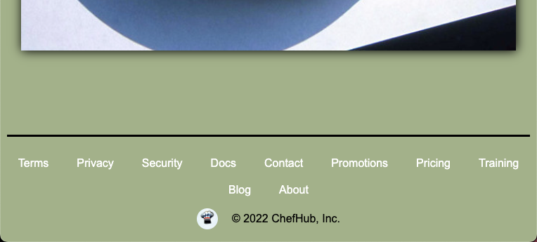

# 🗃 U1LA4 Lab: ChefHub Goes Mobile

### Teacher Notes

Leading up to this Lab, you may want to model again how to inspect a page and use the _Toggle Device Toolbar_. Point out specifically the dimensions of the webpage at the top so that students can use this to validate that their breakpoints are working. This is explained in step 0.

**Students should utilize the Starter Code (**[**repl.it**](https://replit.com/@qrtnycs4all/U1LA4-Mini-Project-Starter-Code#index.html) **|** [**github**](https://github.com/nycdoe-cs4all/interactive-web/tree/main/unit-1-html-and-css-good-vs-bad-design/U1LAB5.1/U1LAB5.1-Starter)**) for this project.**

### Prompt

You've gotten hired for the web design job you were looking to get! The company that hired you is called _ChefHub_, a social media platform for chefs to collaborate with other chefs and to share their recipes, menu designs, and more. The person who left the role you're filling created a beautiful website already, but it only looks great when it's in full screen on a laptop. You've been brought in to make it look good at all sizes - especially on a mobile phone.

**Screen Sizes** For the entirety of the directions, this lab will be refer to 4 screen sizes: **x-large** (default), **large**, **medium**, and **small**. There are more sizes (eg. x-small and xx-large) but only the 4 mentioned will be used here. These are the breakpoint dimensions for the width of screen that you should refer to when writing the `@media` queries:

* `Small` : 0px - 768px
* `Medium` : 768px - 992px
* `Large` : 992px - 1200px
* `X-Large` : 1200px +

**Directions**: Your task is, at each level, to apply breakpoints to change the layout of the page so that smaller screen sizes are accommodated for. The instructions below will guide you through this process incrementally until, at level 5, you have a fully adaptable webpage.

1.  There's two things you should prepare before going into these levels. First, get comfortable adjusting your screen size. The best way to do this is to inspect the page (right click anywhere and click inspect) and click the _Toggle Device Toolbar_ button or on keyboard press `CTRL+Shift+M` (or `CMD+Shift+M` on Mac). This will allow you to see the screen width dimensions while adjusting the screen width. The second note to be aware of is that all the CSS has already been written for the `X-Large` screen size by default for all levels 1-5. You will be writing `@media` queries with the `max-width` parameter to account for the relatively smaller screen sizes. For example:

    ```css
    @media (max-width: 1200px) {
      .container {
        color: red;
      }
    }
    ```
2.  For **level 1**, the photos are arranged using _CSS Grid_. Peak at the ruleset for `.main` for the syntax, and use `grid-template-columns` to change the photos so that they are arranged into 3 columns when the screen is `Large` and `Medium`, and 1 column when the screen is `Small`. Remember, your `@media` queries should be at the bottom of your CSS code. Use the links to the exemplar to see what your results should look like. If you're stuck, here's the code for the first breakpoint:

    ```css
    /* Insert @Media queries here! */
    @media (max-width: 1200px) {
        .main {
            grid-template-columns: repeat(3, 1fr);
        }
    }
    ```
3.  Now that you have the columns sorted, let's fix the margin a bit. At `Medium`, change the margin of `.main` to `20px 50px` and for `Small`, change it to `10px`. Try it first before reading on. If you're stuck, here is what the other 2 `@media` queries should look like in full:

    ```css
    @media (max-width: 992px) {
        .webpage {
            margin: 20px 50px;
        }
    }

    @media (max-width: 768px) {
        .main {
            grid-template-columns: 1fr;
        }  
        .webpage {
            margin: 10px; 
        }
    }
    ```
4. For **level 2**, scroll to the bottom of the page. We'll be adjusting the footer. If you start playing with dimensions making the page smaller, you'll notice that the cards from _level 1_ already adjust as per the `@media` queries you just added. The `level_one.css` is linked for you already on top of the `level_two.html`. This pattern will continue as you move through the other levels.
5. For the footer, use `flex-direction` in the `.footer` class, and use `justify-content` and `flex-wrap` in the `.foot-item` class so that it looks like the exemplar below at all sizes other than `X-Large`. These should all be in a single `@media` query. Notice that the logo and copyright text are below the other items even though it comes first in the `level_two.html`. You'll have to use `flex-direction: column-reverse;` to get the two `divs` to swap in order. 
6. In **level 3**, adjust the `.header` class in following two ways:
   * When the screen is `Medium` and smaller, use `justify-content` to center the items.
   * When the screen is `Small`, use `space-around` instead with `justify-content`. Also, change the `font-size` to `medium`, the `padding` to `10px`, and the `gap` to `20px`.
7.  Now, for **level 4**, as the navbar gets smaller, we want to hide certain items and swap the `+` icon on the right side of the screen for another image the is currently hidden. We're going to use `display: none;` to hide an item, and `display: inline;` to reveal or un-hide it. All of these changes will be made once the screen is size `Medium` or smaller:

    * In the `level_four.html`, find the class name associated with the navbar items _Favorite recipes_, _Comments_, _What's hot_, and _Explore_. Use `display: none;` to hide these items.
    * In the `level_four.html`, find the class name designated to the plus icon, `+`, at the right of the screen, and hide this using the same technique.
    * In the `level_four.html`, the image that will replace the plus icon has the class name `.dropdown`. Use `display: inline;` to make it appear on the navbar.
    * Lastly, use `justify-content: center;` in a `.main-nav` ruleset to center the search bar. The result should look like the exemplar navbar below:

    
8. Head over to the extensions for **level 5**.

### Exemplar

When you're done, the page should look like [this](U1LAB5.1/U1LAB5.1-Starter/level5/exemplar/level5-lg.png) at full screen (x-large) and like [this](U1LAB5.1/U1LAB5.1-Starter/level5/exemplar/level5-sm.png) for example on a large mobile device (medium).

### Culturally Responsive Best Practice

This is a technical lab without a lot of choice, but students can still consider layouts and settings that may best serve their own design sensibilities and needs in future projects.

### Extra Help?

**Not seeing your changes on the screen?** Make sure you are typing your `@media` queries below all the other code in the CSS. If this is already true, try changing something drastic like font `color` or `font-size` before something more subtle to test that the breakpoint is working. Lastly, since we're adjusting the webpage from a big size to all the smaller sizes, you should be using `max-width` for all the changes.

### Extensions

**Directions**:

*   Surprise, as you can see by the new addition of the sidebar, this is actually Gordon Ramsey's ChefHub page. For **level 5**, be especially sure to look at the exemplars to get a good idea of what the design should look like. When the screen size is `Medium` or smaller, the sidebar turns into a second navbar! The goal is to use what you've learned with CSS Grid up until now to reformat the page at this breakpoint. There are two ways you can do this:

    * **Method 1**: using `grid-template-areas` and `grid-area`. This way is easier, most commonly used, and is the most efficient way, but it is trickier to first learn. Regardless, this is the way we recommend doing it, and the site is currently formatted using `grid-area`. Checkout [this video](https://youtu.be/qTGbWfEEnKI?t=319) for an example on how to use it. HINT: In the `@media` query, you will need to only change the one parent `div`.
    * **Method 2**: using `grid-template-columns` and `grid-column`. This way will most likely feel more familiar to you. It is easier to learn, but harder to implement. In the `@media` query, you would need to change all the changed child `div`'s `grid-columns`.

    Choose which ever route you feel comfortable exploring. If you choose to use `grid-template-columns`, be sure to change the pre-written `level_five.css` to be consistent with this method.
* Currently, if you reduce the screen down to below `400px`, Things start looking a bit weird. Go back and add another breakpoint `X-Small` to all the individual parts of the page that need adjusting so that things still look okay in this new screen size. The **x-small** and **small** sizes should be defined as follows now:
  * `X-Small`: 0px - 576px
  * `Small`: 576px - 768px

**Reflection Questions:**

* Why is it important to have breakpoints in your code?
* Whats the difference between starting with a small sized website and building up ("mobile-first") and starting with an x-large sized website and building down ("desktop-first")? Do a little bit of research and see what you can find on which is better or worse and why. Which one makes the most sense and at what time is one approach more sensible than the other?
