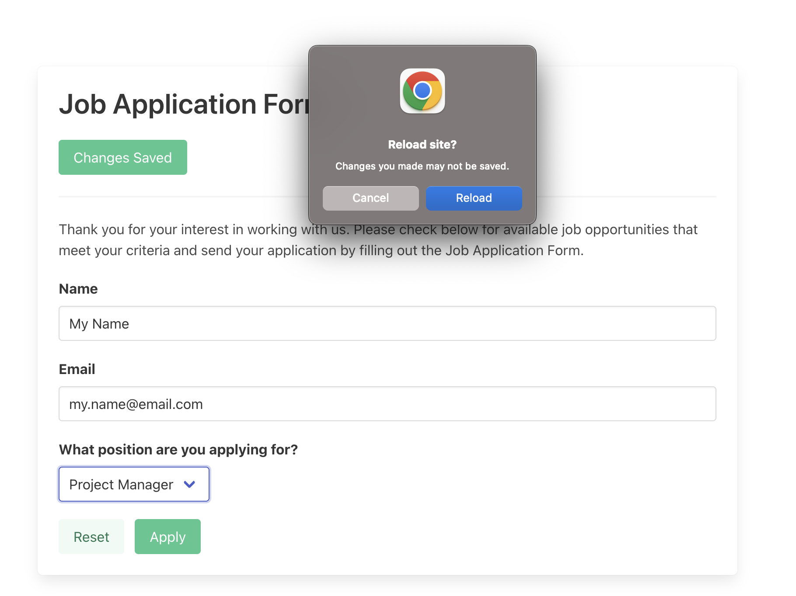

# U3LA4: Local Storage

### Teacher Notes & Overview

In this lesson, students will be using local storage to retain information on their page upon refresh. There are 3 different types of storage: Local storage, Session storage, and Cookies. You don't need much information about all 3 other than whats provided below. This link can offer [more information](https://www.xenonstack.com/insights/local-vs-session-storage-vs-cookie) if so desired.

- Local Storage: stays until you delete it manually and can be accessed from any tab
- Session Storage: expires upon close of the tab and only accessible from the tab it was created
- Cookies: Similar to Local, but expiration can be set and requires "requests" to access (more about that in Unit 5)


### Objectives

Students will be able to:

* Set items into local storage
* Get items from local storage
* Remove items from local storage
* Explain when local storage should and should not be used.


### Suggested Duration

1 period (~45 minutes)

### NYS Computing Standards

[Courtney to Edit]

* **9-12.DL.1** Type proficiently on a keyboard.
* **9-12.DL.2** Communicate and work collaboratively with others using digital tools to support individual learning and contribute to the learning of others.
* **9-12.DL.5** Transfer knowledge of technology in order to use new and emerging technologies on multiple platforms.

### Vocabulary

* **Local Storage** - a web storage type that enables JavaScript sites and apps to store data (key-value pairs) in the browser with no expiration date.
* **Client-side** - everything in a web application that is displayed or takes place on the end user device (the client)
* **Web Browser** - a computer program (such as chrome or safari) with a graphical user interface for displaying and navigating between web pages.
* **Client Browser Storage** - a standard JavaScript application programming interface (API) provided by web browsers that enables websites to store persistent data on users' devices.


### Planning Notes && Materials

| Planning Notes | Materials |
| :------------: | :-------: |
| When using repl.it, please determine if you would like students to clone directly from GitHub, or if you will be setting up assignments via Teams for Education. | _No special materials are required_ |

### Suggestions for UDL

| Multiple Means of Representation | Multiple Means of Engagement | Multiple Means of Expression |
| :----------------: | :------------------: | :--------------: |
| Have students use which ever job they'd apply for in place of the implied computer science job here. While on the medium extension, they can continue input fields that apply to the job they chose.  | Consider having students share their code after adding on different input fields. This would also give them a chance to showcase their interests.  | Wrap Up questions are a great way to determine students overall understanding. Completing the mild and medium extensions will mean a student has learned how to incorporate local storage well.  |

### Suggestions for Differentiation (edit this)

There are only 4 methods that are learned here:

- `localStorage.setItem()`
- `localStorage.getItem()`
- `localStorage.removeItem()`
- `localStorage.clear()`

Consider putting these on the board and having students explore these before going into the starter code. Show them the Application tab in the Dev Tools, and on a blank vanilla JS project, have them use these methods to add, get, remove, and clear data from local storage. 

If you do this, you can then split the class into students that feel like they'd like to try the lesson lesson/demo on their own and those who'd like to see you walk through it. 

Regardless, the "practice activities" have a natural progression in difficulty suited for various learning levels.

### Resources

* [**Repl.it**](https://replit.com/\~)- online IDE
* [**W3 Schools**](https://www.w3schools.com/html/) - readable documentation
* **(OPTIONAL)** [**MDN**](https://developer.mozilla.org/en-US/) - a robust but sometimes less student-friendly documentation
* [**Practice: "NYC Boroughs"**](/unit-2-intro-to-dom-manipulation-basics/U2LA3/U2LA3-Starter/index.html) 

### Assessments

**Formative:**

- Overlook **students' code** during the warm up and during the practice activities as an informal formative assessment.
- **Wrap Up** reflection questions can serve as formative assessments.

**Summative:**

- Unit 3, Lab 3 (Upcoming Lab)

- Final Project (End of Unit Project)

### Do Now/Warm Up (\~5 min)

"What things would you want your browser or a website to remember, and when would this be important? Think about if your computer were to crash!" Open a discussion or have students think-pair-share with this question at the forefront. Some examples:
- Website settings or preferences - dark mode, zoom depth, notifications, blocking certain content, etc.
- Form or quiz data - halfway through a long test or application
- If you're logged in or not (but not your sensitive account information)
- My tabs! Keep them open.

After, have students open up and run the starter code. Fill out the Job Application Form with them and have them restart the webpage before clicking "Apply". Up until this point, the websites we've created have cleared all changes made to the website when refreshed. Today we learn how to _persist_ those changes.

### Lesson & Demo: Approaching Problems (~35 min)

0. Open the `script.js` and notice that most of the DOM selectors we'll need for this are already created. We'll be working with `inputs` for the most part.

1. The variable `controls` holds all the references to the input fields (name, email, and position). Use `forEach()` to add an event listener to each one. Call the function `saveChanges` on input.

    >  NOTE: `saveChanges()` calls `spinLoader()` by default which you can ignore for now. If it interests you, feel free to check it out in the `loader.js`. 

2. To save the changes, add the input to **Local Storage**. Copy and paste this code into the function.
    ```js
    const saveChanges = (e) => {
        spinLoader();

        // comment 1
        const inputID = e.target.id;
        const inputValue = e.target.value;

        // comment 2
        if( inputValue && inputValue !== '- Select -' ) {
            localStorage.setItem(inputID, inputValue);
        } else {
            localStorage.removeItem(inputID);
        }
    }

    controls.forEach( input => input.addEventListener('input', saveChanges));
    ```

    Ask students to predict what this code is doing. Consider doing it through a turn and talk and having them refer to the `index.html` as needed. Take some time to walk through the code with them highlighting the new parts above.
    - comment 1: save the input element's id value and inputted text in a variable
    - comment 2: if there is an input to save, and if the input is not the default _"Select"_ value, add it using `setItem(ID, VALUE)`, otherwise, delete the reference using `removeItem(ID)`

3. To further illustrate that this is working, run the page and open the _Application_ tab in the inspect _Dev Tools_. On the sidebar, click the file under _Local Storage_ fill out the form. Notice the appearance of key and value pairs, and the disappearance once the input is removed.

4. Next, we need to make sure the code first checks for any inputs already in storage when the page loads. If so, it should retrieve and default to those values. Use [Object.keys()](https://developer.mozilla.org/en-US/docs/Web/JavaScript/Reference/Global_Objects/Object/keys) to iterate over all the keys in local storage. Use the object `inputs` to check that the key in local storage matches what we need. In the `script.js`, the object `inputs` has a key value pair for every input's ID and DOM element respectively. Console log for more clarity.

    ```js
    //partial answer - just to see local storage saved data
    Object.keys(localStorage).forEach(key => {
        console.log(key)
    })
    ```
    <details>
    <summary>Full answer for #4</summary>

    ```js
        Object.keys(localStorage).forEach(key => {
            if( key in inputs ){
                inputs[key].value = localStorage.getItem(key);
            }
        })
    ```
    </details>
    

5. Last, configure the reset button to:
    - `spinLoader()`
    - clear local storage using `localStorage.clear()`, and
    - manual reset the input fields by setting their `.value` property.

    Then, check here to compare your solution.

    ```js
    const reset = document.querySelector("#reset");

    reset.addEventListener('click', ()=>{
        spinLoader();
        
        localStorage.clear();
        Object.values(inputs).forEach(input => {
            input.value = '';
        })
        inputs.dropDown.value = '- Select -';
    });
    ```


**Practice Activities**

**Mild**
- When the user hits the apply button, reset the inputs and local storage, and alert a message saying something like, "Thanks for your application for CHOSEN POSITION, NAME. We sent a confirmation email to EMAIL"
- If you look in the footer of the `index.html`, there's a results `p` element with `id="results"` already made. Instead of alerting when the user hits apply, display the message in the innerHTML of this element.

**Medium**
- Add 2 more input fields and make sure they're connected to local storage. Here are some examples if you get stuck:
    - When can you start? (Date input)
    - What is your current employee status? (drop down: employed, self-employed, unemployed, student)
    - Why do you want to work here? (large text field)
    
    Here's the link to [the Bulma documentation](https://bulma.io/documentation/) if you need it.

**Spicy**
- Use `window.onbeforeunload` to alert the user they are about to lose data if they reload. This should only happen if they forgot to enter an email. [Use this link to learn more](https://dev.to/chromiumdev/sure-you-want-to-leavebrowser-beforeunload-event-4eg5). Below is an example of what it looks like on Chrome.



### Wrap Up (\~5 minutes)

If you'd like time to collect their work, this would also be a good time. If you are not using Repl.it Teams for Education, a great way to collect projects quickly is a Google Form where they submit their link as well as any reflection questions.

- Earlier you saw how easy it was to access local storage in the Dev Tools. What kind of information would you not want to store in local storage?
- What challenges did you face? How did you overcome them?
