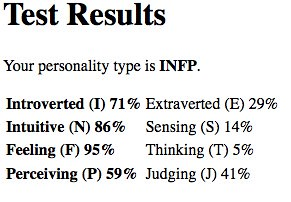
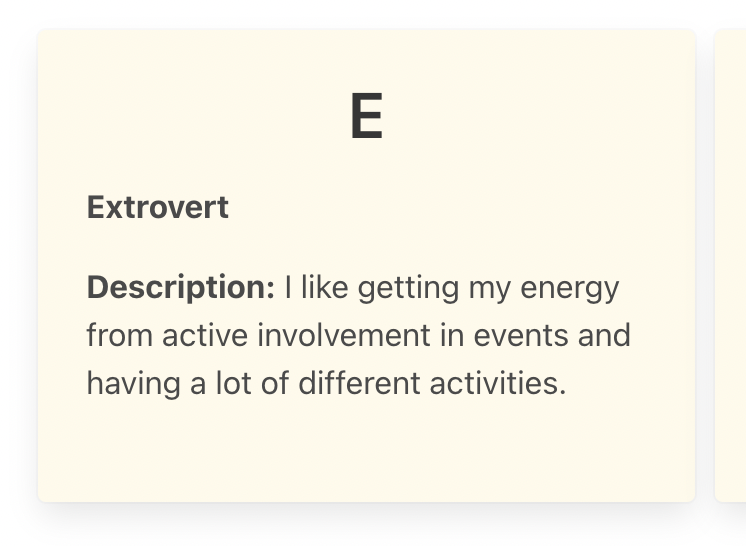

# Fuzzy Matching Personality Quiz

### Teacher Notes

In this lab, students will have the opportunity to build a personality quiz with some guidance. The teacher will walk students through a trivial version (the exemplar), and students will, similar to a unit project, brainstorm ways to personalize it adding different forms of inputs, creative outputs, and implementing concepts in the previous few lessons.

Most students will have a hard time coming up with an algorithm that will calculate the final result of their test even with guidance below. Prepare some simple visual examples that students can use to get started. For example if there are 4 results that can be put on an XY-axis, draw what this may look like and show how each questions will push the quiz taker higher or lower on an axis. 

### Prompt

What is your personality type? Which character from your favorite movie pr show are you most like? What color is your energy? In a personality quiz, you answer questions to discover what category you most align with. First code along as you see how it's done. Then, make it your own!

**Directions**: Walk through the following steps to complete and take the sample "Fuzzy Matching Quiz" based on the Myers-Briggs personality test. Then, in the challenges, you'll have a chance to expand it and personalize it to your own Quiz.

0. The trickiest part about doing a personality quiz is taking the user's inputs and converting it into an output. Later you will be given some ideas on different ways to do this, but for now we will do this: There are 4 questions on the website. For each question, you can be 1 of 2 personalities. At the end, you will be a culmination of 4 total personalities (indicated by 4 letters). For example:



**The Input**
1. First thing that happens is that a user selects the radio button inputs. Use `querySelectorAll()` to select all the radio inputs. Then, add an event listener to all of them. For now, just console log the value. Try this yourself before seeing the code below:
    ```js
    const inputs = document.querySelectorAll("input");

    inputs.forEach(input => {
        input.addEventListener("click", (e) => {
            console.log("Value", e.target.value)
        });
    });
    ```

2. Let's make some observations: When you open the console, notice that a single letter is outputted. This letter corresponds to the matching personality. Look at the `letterDescriptions` variable in the `script.js` for some examples. Now, change `e.target.value` to `e.target.name` and notice what is outputted. With the name and the value, you can create an object with the user's results.
    ```js
    let results = {
        first_letter: 'E',
        second_letter: 'S',
        third_letter: 'T',
        fourth_letter: 'J'
    }
    ```

3. Create the above object with an empty string for each value `''`. Then, change the event listener so that it sets the object on click.
    ```js
    inputs.forEach(input => {
        input.addEventListener("click", (e) => {
            const name = e.target.name;
            const value = e.target.value;

            results[name] = value;

            // Optional log but helpful
            console.log(results)
        });
    });
    ```
    You can log the results each time and notice what happens when you start filling out the quiz.

**The output**
4. Take the time to make another observation. When you click the button, notice that most of the output is set up and formatted for you. There should be 4 badges each with 1 letter, the word/title that that letter represents, and a description for that letter. However, you may have some text missing:



5. Go into the `script.js` and use the `letterDescriptions` object to fix the `displayBadges()` function so it looks like the example above. After doing so, the code segment should look as follows, and the quiz should be ready to take:
    ```js
    <div class="content">
        <h1 style="text-align: center">${letter}</h1>
        <p><b>${letterDescriptions[letter].title}</b></p>
        <p><b>Description:</b> ${letterDescriptions[letter].description}</p>
    </div>
    ```

### Exemplar

Take a look at this [finished example](./U3LAB2-Exemplar/index.html) for the finished version of the site.

### Culturally Responsive Best Practice

Scope out the strategies students plan to use when creating the quiz to ensure they stay on track with the curriculum, but allow students to explore themes that they identify most with. Consider spending a few minutes asking the students to find the funniest or most interesting quizzes they can find. Allow them time to explore resources like [BuzzFeed](https://www.buzzfeed.com/quizzes), [PsyCatGames](https://psycatgames.com/quiz/), or [PlayBuzz](https://www.playbuzz.com/quizzes/personality)... [more](https://funpersonalityquizzes.net/)

_Note: scope out the resources provided. The quizzes change constantly, and it can not be assured that they are appropriate for school. You may instead want to compile several examples that you have pre-scanned and feel comfortable using in the classroom._

### Extra Help?

- Quizzes to get inspiration:
    - [What Fruit Are You? - Buzzfeed](https://www.buzzfeed.com/natalyalobanova/what-fruit-are-you)
    - [What's your road trip personality? - Truity](https://www.truity.com/test/travel-personality-test)
    - [Another Short Myers-Briggs Test](https://dynomight.net/mbti/)

- Long video on making [JS Buzzfeed-style Quiz](https://www.youtube.com/watch?v=7x2Zk1qwBBU)

### Extensions

Use the following steps to plan out how you will change the personality quiz to be your own.

**Directions**

1. With your partner, do some research and exploring and think up what kind of personality quiz you'd like to set up. It can be **silly** like "What fruit are you?" or **serious** like "What vacation is best for you?". _If you're not sure, go with the vacation spot!_

2. Then, write down all the possible results your quiz can end in. Will there be **only 2** (ex. "Your more left brain than right brain" or "Your more right brain than left brain")? Or, will you have **several results** (ex. "Out of all the fruits your most likely a watermelon!")? _If you're not sure, we recommend picking 3-4 vastly different results like "Space", "Cabin in Alaska", "Staycation", and "New Orleans"._

3. **Inputs**: For the walk through above, radio buttons were the inputs for the quiz. Will you use radio buttons with words or pictures to select from, will you use drop down menus, will you have checkboxes as to allow multiple selections? Also, think about how you will store the user's responses. _Most common is using radio buttons and an object. That's what we'd recommend if you're unsure._

4. **Calculating Results**: Here are some ideas for how you can narrow down the user's inputs into some results. Choose 1:
    - **[MILD]** - Each answer in the quiz can award positive **points** to a category or personality type. At the end of the quiz, which ever personality type has the most points is the one the user will get.
    - **[MEDIUM]** - If your results can be put on **a scale**, start a score at 50 and have each question add or subtract points to the score. At the end, use the number to give the user a different personality type. _(ex. "Netflix and PJs" would be a 0-35% => always likes to be alone, "Party Animal" would be a 65-100% => never likes to be alone, and maybe even "Hard to Get" would be a 35-65% => likes a balance of both)_ You can split this in 2, have 3 zones, or how ever many zones you need.
    - **[SPICY]** - You can use **multiple scales**! Each question can add or remove points to one or more scales. For example:
        - Scale1 = likes to be outside vs. likes to be inside
        - Scale2 = likes to be along vs likes to be with others
        Based on the combination of the 2 scales, you can give the user a different personality type _(ex. outside & alone = "Vacation in Space!")_ If it helps, think of this one like an XY graph.

5. **Outputs**: Finally, what will you show the user once they hit submit?
    - [MILD] - Will it be a single output?
    - [MEDIUM] - Will you show a few or all possible outcomes and their percentage in each category? (ex. "Your 70% lion and 30% mouse")
    - [SPICY] - Will it have a more detailed description or a unique picture to go with it?

6. Now that you have your plan, get your quiz up and running! Refrain from focussing on font, images, color and other styling for now. Also, (IMPORTANT) start with **1** question, and add more once you have it working.

7. Once, you can complete the quiz and get a unique result, go back and add styling, images, and more questions. 

**Reflection Questions:**

- What are you most proud of? What did you struggle the most with?
- How much preplanning did you do before you coded? How did it help? How would doing more or less preplanning help or hurt final outcome of your personality quiz?
- With more time, what else would you have added or changed?