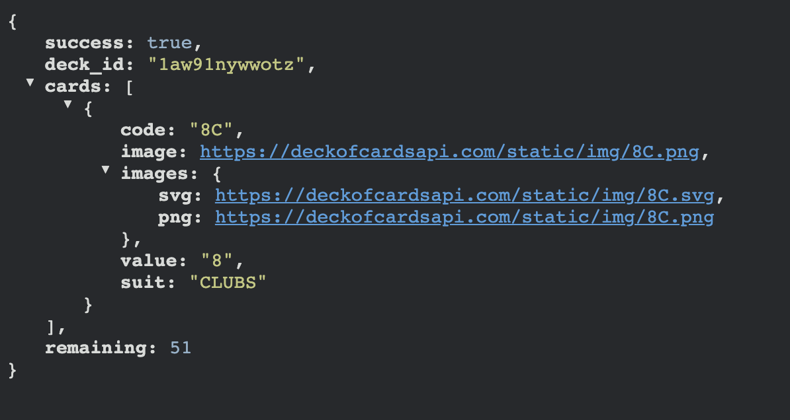

# Deck of Cards: Higher Lower

### Teacher Notes

In this lab, students will be working off a new open API, the [DeckOfCardsAPI](https://deckofcardsapi.com/). The goal is to give students another chance to familiarize with another open API by practicing both writing API calls and reading responses.

The walkthrough consists of 3 parts:

1. **"Familiarize yourself with the API"** - A chance to learn the new API through the browser
2. **"Use real API calls"** - Students use async await functions in the `api.js` to access the same endpoints and responses.
3. **"Program the front end"** - Students call their async functions in the `script.js` and connect functionality from the HTML front end.

In the extensions, after students feel comfortable using this new API, students have the opportunity to:
 - Connect the responses to the HTML code
 - Get another at bat at creating an async function in `api.js` and connecting its functionality in `script.js`.
 - Turn the website into a card game "Higher or Lower". _NOTE: this is a spicy extension and students shouldn't feel like they've failed if they don't get to this._

### Prompt

We'll be using a new open API for this lab. The [DeckOfCardsAPI](https://deckofcardsapi.com/) has endpoints that allows for users to get an ID for a deck of cards and do things like shuffle, deal, create piles and more. In the walkthrough, you will get a chance to get familiar with API and put together a simple website that deals cards. In the extensions, you'll create a game of "Higher or Lower".

**Familiarize yourself with the API**: 

1. Head over to https://deckofcardsapi.com/ and look at the first 4 endpoints. We can test them out right in a new tab. The goal is to:
    - Get a new shuffled deck and its `deck_id`
    - Use the `deck_id` to draw a card.
    - Return and shuffle the cards to the deck.
2. **Get a new shuffled deck and its `deck_id`:** Open a new tab and enter the following endpoint: `https://deckofcardsapi.com/api/deck/new/shuffle/`. Copy and save your `deck_id`. The one I got is `1aw91nywwotz`. I'll be using it in the examples to follow.
3. **Use the `deck_id` to draw a card:** Now, there's no way to see all the cards and their order in the deck, but we can start dealing or drawing them. Use the following endpoint to deal the top card of your shuffled deck: `https://deckofcardsapi.com/api/deck/YOUR_DECK_ID/draw/`. When I put my ID in, the endpoint looks like this `https://deckofcardsapi.com/api/deck/1aw91nywwotz/draw/`.

    You should have gotten a response like this:
    

4. I got the 8 of clubs! Notice how there's even a link to a static image that can potentially be used in a website. If you visit the same endpoint again, notice how you will draw a different card. Do this a couple times and notice the different cards that come up and how the `remaining` attribute goes down.
5. **Return and shuffle the cards to the deck:** Last, lets return the cards you drew back to the deck and shuffle the deck at the same time. See if you can find this endpoint before checking here for the answer.
    <details>
    <summary>How to return and shuffle</summary>

    `https://deckofcardsapi.com/api/deck/YOUR_DECK_ID/shuffle/`

    Turns out, when you shuffle the deck, it automatically returns all dealt cards.
    </details>

**Use real API calls**

1. So the 2 API endpoints we used in the browser are:
    - `https://deckofcardsapi.com/api/deck/new/shuffle/` - gets us a new deck that is shuffled.
    - `https://deckofcardsapi.com/api/deck/YOUR_DECK_ID/draw/` - get us the next card off the top of the deck.
2. In `api.js`, complete the two functions so that they return the following data. Also, throw in some console logs to ensure you're getting the desired output.
    - `getNewDeck()` - This will create a new deck and return the deck ID. 
    - `getNextCard(deck_id)` - This will draw a single card and return the object of that card.

3. When your done, it should look like this:
    ```js
    const BASE_URL = "https://deckofcardsapi.com/api/deck";

    // creates new shuffled deck - returns deckId
    const getNewDeck = async () => {
        const endpoint = `${BASE_URL}/new/shuffle/`;
        const response = await fetch(endpoint);
        const data = await response.json();
        console.log(data);

        return data.deck_id;
    };
    ```
    <details>
    <summary> And this is what <b>getNextCard(deckId)</b> looks like:</summary>

    ```js
    //deals out how ever many cards you need
    const getNextCard = async (deckId) => {
        const endpoint = `${BASE_URL}/${deckId}/draw/`;
        const response = await fetch(endpoint);
        const data = await response.json();
        console.log(data);

        return data.cards[0]; // Just return the card drawn
    };
    ```
    </details>

<!-- 4. Lastly, in `index.html`, comment the `sampleApi.js` script and uncomment the `api.js` script. Test the website and see if your deck is now dealing random cards! -->

**Program the front end**

0. Open the `script.js`, and run the code to see what the website looks like. Recall the following 2 functions that you just created. You will use these in the `script.js` to draw cards from a shuffled deck. For now the cards will be logged in the console.
    1. `getNewDeck()` - This will create a new deck and return the deck ID. 
    2. `getNextCard(deck_id)` - This will draw a single card and return the object of that card.

1. In the `script.js`, finish the `startGame()` function to create a new deck and draw the first card:
    - Turn the function to an async function, and await a call to `getNewDeck()`. Console log the deck ID that's returned.
        ```js
        const startGame = async () => {
            // create a new deck and save the deck ID
            deckId = await getNewDeck();
            console.log(deckId);
        };
        ```
    - Then, await for the response for `getNextCard(deck_id)`, and console log that as well. 
        ```js
        const startGame = async () => {
            // create a new deck and save the deck ID
            deckId = await getNewDeck();
            console.log(deckId);

            let firstCard = await getNextCard(deckId);
            console.log(firstCard);
        };
        ```
    Run the code and check the console for the response. You should see the first card.

2. Now, finish the `drawCard()` function that will be activated when the draw button is clicked. It should get the next card using the function `getNextCard()` and log it to the console for now (in the same way it's done in `startGame()`).
    ```js
    const drawCard = async () => {
        // draw a card from deck
        let nextCard = await getNextCard(deckId);
        console.log(nextCard);
    };
    ```

3. Test the website while keeping the console open. You should see the first card when the site is run, and every time you press "Draw", you should see the next card in the deck.

4. Great! lets fine tune some things. Since the second half of `startGame()` is doing the same thing that `drawCard()` is doing, replace that code with the function call instead as follows:
    ```js
    const startGame = async () => {
        // create a new deck and save the deck ID
        deckId = await getNewDeck();
        console.log(deckId);

        drawCard();
    };
    ```

### Exemplar

Take a look at this [finished example](./U3LAB2-Exemplar/index.html) for the finished version of the site.

### Culturally Responsive Best Practice

This lab uses a standard 52 deck of cards. Some students may not have any experiences playing with such a deck or regardless may not know the value of a jack, queen, king or ace. Consider having your students play a game of higher or lower, or war with each other in preparation for this lab. 

The goal of this lab is to have students feel comfortable with using open APIs and incorporating the response data in a website. Feel free to choose a different API if you find that your students will better resinate.

### Extra Help?

- [Using Fetch API MDN](https://developer.mozilla.org/en-US/docs/Web/API/Fetch_API/Using_Fetch)
- Video on [async/await](https://www.youtube.com/watch?v=_9vgd9XKlDQ), try catch errors, and more.
- [Try Catches](https://javascript.info/try-catch) and how to use them.
- Answer to 2nd Mild Extension:
    <details>
    <summary> <b>script.js</b> answer for <b>drawCard()</b> </summary>

    ```js
    const drawCard = async () => {
        // draw a card from deck
        let nextCard = await getNextCard(deckId);
        console.log(nextCard);

        const drawPile = document.querySelector("#draw-pile");
        drawPile.innerHTML = `</img>`;
    };
    ```
    </details>

### Extensions

**Mild**

- Instead of console logging the whole object, log just the value of the card ('2', '6', 'KING', etc.)
- Adjust the `drawCard()` function so that the image of the card displays on the website. _Note: the link to the image is apart of the response of each card._
    - In the `index.html`, find the Span ID that contains the image of the drawn card.
    - In the `script.js`, every time `drawCard()` is called, it should use the card object to put the image in the innerHTML of the span.
    Look at Extra Help for more assistance on this.

**Medium**

- Create a function `convertValue(value)` in the `script.js` that takes in a value (eg. '9', 'ACE', 'KING') and returns the numeric representation of the value ('9' => 9, 'ACE' => 1, 'KING' => 13).
- In the `drawCard()` function, use `convertValue(value)` to console log the true numerical value of the card being drawn. 
- Program the Refresh Button. Add a `shuffleDeck(deckId)` function in the `api.js`.

**Spicy**

- API calls are typically made in a `try/catch` statement to ensure any 404 responses are caught. Check out this example and the link in the Extra Help section above, and incorporate it in the `script.js`.
    ```js
    try {
        // try this stuff
        data = await getData();
        console.log(data[0]);
    } catch(error) {
        // if it doesn't work do this
        console.log("You've encountered an error:", error);
    }
    ```

- "Higher Lower" - Follow the following steps to turn this use of an API into a little game:
    1. In the `index.html`, replace the section id="buttons" with the following html code:
        ```html
        <!-- Score -->
        <p id="score">Correct Guesses = <span id="scoreCount">0</span></p>

        <!-- Buttons -->
        <section id="buttons">
            <button id="lower" class="button">Lower</button>
            <button id="higher" class="button">Higher</button>
        </section>
        ```
        You should now see a score and two new buttons.
    2. In the `script.js`, in the `drawCard()` function, instead of logging the value of the card, return it. Then, create 2 global variables: `previousValue` and `newValue`. The first card should be set to the `previousValue` when the game is started, and any other time the function is called, save it to `newValue`.
    3. Create a new function that will trigger when the buttons higher or lower are clicked. It should...
        - Draw a card
        - If the user picked the button that represents the value of the new card compared to the previous card, give them a point. (For example, if a 3 is showing and an ACE (value 1) is drawn, then the ACE is "lower". So if the user clicked lower, then award them a point, and if they predicted higher by clicking higher, then do not give them a point.)
        - If the same value comes out, automatically draw the next card.


**Reflection Questions:**

- What are you most proud of? What did you struggle the most with?
- What do you think would be the benefit of using an API to access data instead of accessing the data straight from the database? What are the drawbacks?
