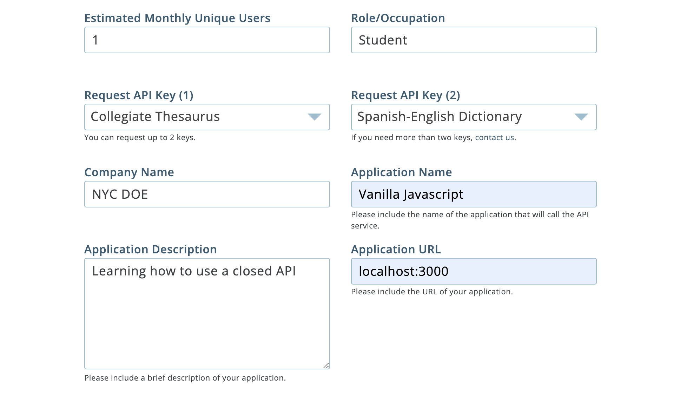

# DIY Dictionary

### Teacher Notes

Students will be building a website that accesses a Dictionary API. The API requires a user's _"api key"_ and a _word_. It will return the definition, synonyms, and more. The instructions below loosely walk through retrieving the API key before guiding students to a finished version of the website represented by the exemplar.

The DictionaryAPI was chosen because of its relatively simple and free sign up process. Realistically, the sign up process can be much more difficult. However, this lab aims to give students a glimpse into closed APIs and, more importantly, another chance to practice using APIs in general. The final lab would therefore be a good chance for students to explore other APIs that match the difficulty they desire.

### Prompt

Most APIs you will run into are closed. For the most part, closed and open APIs are similar in how they function. However, closed APIs have the addition of an API key. Sign up for an API key at Merriam Webster's DictionaryApi.com and follow the directions below to make a Dictionary Look Up website.

**Directions**: Walk through the following steps to get connected to the closed Dictionary API.
1. First, you will need to register for an API key
2. Next, you will connect to the API in the `api.js`.
3. Then, you will finish the code in the `script.js` to manage user input and API output. 
4. Last, you will explore the extensions and make this DIY Dictionary site really special. 


**Register for an API key**: 

1. Go to Merriam Webster's [DictionaryAPI.com](https://dictionaryapi.com/), scroll down, and register for an api key. Once you do, you'll have to confirm with the link provided in your email. This process should take about 1 minute. The picture below will give you an idea on how to fill out the registration form.


> Note: be sure to pick the thesaurus as the first API request as this is the main endpoint being used in this lab. The spanish english dictionary is being used for the extensions in this lab.

2. Once you successfully register and confirm your email address, you should be able to sign in and access [your 2 api keys](https://dictionaryapi.com/account/my-keys). Copy and save them in a safe place on your computer.

3. In the `api.js`, save your API keys in a variable. For example:
    ```js
    const THESAURUS_API_KEY = 'YOUR_API_KEY123';
    const SPANISH_API_KEY = 'SPANISH_API_KEY456';
    ```

**Connect to the API**: 

For this section, we'll be working from the browser to quickly test the endpoint and your API key. Then, we'll code in the `api.js`.

4. There are several APIs that are provided by DictionaryAPI found at [this site](https://dictionaryapi.com/products/index). You should have signed up for the [Thesaurus API](https://dictionaryapi.com/products/api-collegiate-thesaurus) and the [Spanish/English API](https://dictionaryapi.com/products/api-spanish-dictionary). At those links, you can find the endpoint you will need to access. Here's the one for the thesaurus, the first one we'll be using:
    ```js
    'https://www.dictionaryapi.com/api/v3/references/thesaurus/json/WORD?key=YOUR-API-KEY'
    ```

5. In the browser, in a new tab, copy and past this endpoint, and replace `WORD` with any word like _"umpire"_ and `YOUR-API-KEY` with the API key your received when you registered. 
    ```js
    //Note: not a real API key
    'https://www.dictionaryapi.com/api/v3/references/thesaurus/json/umpire?key=123456789abcdefghi'
    ```
    If you do this right, you should see a JSON response for the word umpire!

6. In the `api.js`, finish the function `getDef(word)`. Use the endpoint above as the template, and use string formatting to include the "word" parameter and your API key. For now, console log the data. To see if it works, call the function in the `api.js` with any word. For example, `getDef("umpire");`

7. If you can see the object in the console, celebrate! Return the data instead of logging it. Your finished version should look like this.

    ```js
    const BASE_URL = 'https://www.dictionaryapi.com/api/v3/references/thesaurus/json/';
    const THESAURUS_API_KEY = 'YOUR_API_KEY123';
    const SPANISH_API_KEY = 'SPANISH_API_KEY456';

    const getDef = async (word) => {
        const word_endpoint = BASE_URL + word + '?key=' + THESAURUS_API_KEY;
        try {
            const response = await fetch(word_url);
            const res = await response.json();
            return res;
        } catch (error) {
            console.error(error);
        }
    };
    ```

**Finish the `script.js`**: 

Notice that a lot of the code is already pre-written. For this section, you'll just need to fill in the variables to connect the website with the API calls.

8. In the `script.js`, the `getSimpInfo(word)` function should return a simplified object with just the word, the part of speech (noun, verb, etc.), and the definition. Replace `'PART_OF_SPEECH'` and `'DEFINITION'` with the actual data from the response. Console log this new `finalData` to check that it works.

9. For the makeCard(finalData), do the same thing. The object you just created will be passed to this function, so it will have the same 3 features.

10. Last, for the event listener:
    - Call `getSimpInfo(word)` to get the `finalData`, and
    - Call `makeCard(finalData)` to get the html string that you will set as the innerHTML of the card. (NOTE: the card div is queried at the top of the `script.js`)

11. When you're done, the site should allow you to input a word and see the definition displayed in the blue card.

### Exemplar

Take a look at this [finished example](./U4LAB2-Exemplar/index.html) for the finished version of the site.

### Culturally Responsive Best Practice

Consider giving students a list of 5-10 words that the students can look up once they have their website running properly. This way, they won't stuck on searching for which word to use (NOTE: this is also a good opportunity to sneak in some vocabulary from other subject areas). Otherwise, you can have students come up with 5-10 words from their favorite subject or domaine that they will plan to test using their site. 

### Extra Help?

- [Using Fetch API MDN](https://developer.mozilla.org/en-US/docs/Web/API/Fetch_API/Using_Fetch)
- Video on [async/await](https://www.youtube.com/watch?v=_9vgd9XKlDQ), try catch errors, and more.
- [Try Catches](https://javascript.info/try-catch) and how to use them.

### Extensions

**Mild**

- Include synonyms in the definitions. If you look at the response, you should notice an array of synonyms for the word. Add another `<p>` element in the `index.html` and adjust the `script.js` to incorporate these synonyms.
- Handle the error when the submitted word doesn't exist. You can choose how your site will respond: will you clear the current card or maybe display a message that says "No such word found in the dictionary".

**Medium**

- Include all definitions that come with each word. Some words have more than one definition (ex. umpire has a noun and verb definition). When a word is submitted, create a card for each of its definitions.
- Turn all the synonyms into a link! When clicked, automatically look up the clicked word and show results for that word. Also, include the clicked word in the search bar.

**Spicy**

- The other API you should have access to is the [Spanish/ English dictionary](https://dictionaryapi.com/products/api-spanish-dictionary). Add a translate button on the card that when clicked shows the translation of the word into Spanish.
- When the searched word doesn't exist, check out your response! You should get an array of suggested words. Use this array to make recommendations for your user in some way. For example:
    - After a word submission you can display links to the other suggested words, or
    - It could be a drop down of suggestions after each letter is typed in the search bar.


**Reflection Questions:**

- Why might one favor a closed API over an open one? What would you assume are the benefits of making your API closed.
- Why might someone else favor an open API over a closed one? What are the drawbacks of making your API closed?
- What is something about APIs that you still would like to explore?