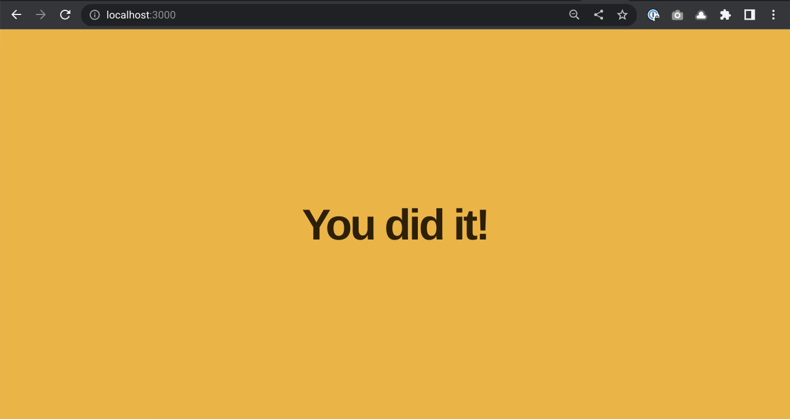

# U5LAB1: Express Lab

## Teacher Notes

This lab is about setting up a basic static file server with Node and Express. It's sequenced after the client-side socket material and before the server-side socket material. In practice, setting up a socket server means setting up a server and serving the client from it to avoid cross-origin browser restrictions. This lesson is intended to bridge the gap between consuming sockets and serving sockets. It's limited to serving static files, but simple REST-ish APIs are an easy extension.

Note that the syntax for Node modules is in transition. All of these lessons use the (finalized but technically experimental) ESM `import`/`export` syntax that's used in front-end JavaScript, but Node has historically used the CommonJS `require`/`module.exports` syntax. They are very syntactically similar and serve the same purpose, but ESM modules are statically linked and CommonJS modules are imported at runtime. The bigger issue is that both in very common usage in learning resources across the web, so anticipate some confusion about this.

Modules cheat sheet:

```js
// CommonJS
const express = require("express")
const app = require("./app")
export default app

// ESM
import express from "express"
import app from "./app"
module.exports = app
```

## Prompt

You've been building websites for a while. Have you ever wondered how the computers hosting your HTML, CSS, JavaScript, media and other files deliver them to your browser? It's time to build a static file server that can host websites!

## Directions

> Replit users:
> - No need to install anything! Upon the first time you hit Run, Replit will automatically install any dependencies. Depending how you structure your lesson, you may (and can) also do this manually.
> - `npm test` should and can still be used from the `Shell` tab.

### Install Dependencies

The starter code for this lab contains tests to give you feedback on your progress. **Download the lab's dependencies by running `npm install on the terminal**. This may take a while and a lot of lines may go by on your screen. The platform you're working on may also already have done this. That's OK, it doesn't hurt anything to run this command multiple times.

### Run the tests

Next, run the tests to make sure everything was installed correctly. **Run `npm test` in your terminal**. You should see an error that looks like this:

```text
SyntaxError: The requested module './app' does not provide an export named 'default'
```

While the words may be unfamiliar, this is an informative error:

* The problem is the syntax, meaning that the code can't even be run because it's missing something required
* The code that `npm test` executed asked for the code in the file `app.js`
* Specifically, it was looking for something in the file called a default export
* Unfortunately, `app.js` doesn't have a default export

Therefore, Node is giving up.

This is also explaining what the next step should be: Because the test code can't find a default export in the file `app.js`, adding a default export should fix the error. **In the file `app.js`, add `export default "Hello, world!"`.** Run `npm test` in your terminal again and you should see an error that looks like this:

```text
app.js should export an Express app.
```

To move to the next step, we need to make `app.js` export an Express app instead of the string "Hello World."

### TDD

This process of:

* Running a failing test
* Understanding the error
* Fixing the error
* Running the test again to see if it still fails

Is called test-driven development, or TDD. TDD is a technique for getting automatic feedback about your code by having a test script run your code for you. In addition to just running the code, the tests also check to see if the app is behaving the way you expect. This is more efficient than manually checking your code yourself after every change. You can make the tests automatically run again every time you save your code, run:

```bash
npm run test:watch
```

Note that running the tests once is `npm test`, but running them continuously requires adding the word `run`. Press `q` to stop the tests.

In this lab all the tests are written for you, but it's even possible to write these tests yourself as part of your development process. You can explore the code in `index.test.js` to see the code for these tests.

### Installing Express

The error says we need to export an Express app, which means we need to install Express.

Express is an open source package. That means a group of volunteers works on this code and makes it available to others to use, extend, and learn from. For example, you can explore the [code for Express on GitHub](https://github.com/expressjs/express) and even make your own copy of it and make changes. If you think others might like your changes, you can submit them back to the team that manages Express. This open source contribution process powers the majority of the software used on the web.

We could download the Express files and try to set it all up by hand, but Node comes with a better tool for this called npm. npm (informally known as "node package manager") is a tool for installing packages like Express. It's also used for configuration and storing scripts, such as the `npm test` and `npm run test:watch` scripts you've used. npm packages are hosted at [npmjs.org](https://www.npmjs.com/), which also includes details about how to install them.

**Go to the [npmjs.org](https://www.npmjs.com/) and find Express. Follow the instructions on the site to install it.**

If you've done this correctly, you should see a line in the file `package.json` that looks something like this (it's OK if the numbers don't match):

```json
"express": "^4.18.2",
```

### Modules

Modules are a way to allow files to import and export pieces of code. This helps break up big files into lots of small ones and encourages reusable code. To import code from an npm package, use an import statement. These have two parts:

1. What you want to call the import
2. Which package exports it

For example, to import the default export from the npm package `supertest` and save it in a variable called `request`, you'd write:

```js
import request from "supertest"
```

Notice the lack of quotes on the variable name and the quotes on the name of the package.

**Import the express package into `app.js` and save it in a variable called `express`**.

To export code from a file, write `export default` in front of it, like you did with `"Hello world!"`:

```js
export default "Hello, world!"
```

At this point, your `app.js` file should be importing Express, exporting `"Hello world!"`, and your tests should still be telling you that `app.js` need to be export an Express app.

### Creating an Express app

The module that the Express package exports is a function and calling it creates a new Express app.

**In `app.js`, create a new Express app and save it in a variable called app. Export this variable instead of the "Hello, world!" string.**

You should get a new error now, something like:

```text
The response needs to be HTML
```

### Serving Static Files

This error makes sense, because you've created an Express app but you haven't told it how to handle any requests yet. This code tells Express to host all of the files in the folder `./file-folder-here` on request:

```js
// app.js
app.use(express.static("file-folder-here"))
```

All of the static files for the site are currently stored in the `client` folder. **Serve the folder containing your static files.**

If you run your tests now, you should see them all passing. Way to go!

### Run the server

The logic of the app.js the client folder is tested and works, but there's one problem: We aren't actually running a server! Luckily, this is a simple task once you're confident the logic works.

In the `index.js` file, we need to import the app from `app.js` and tell it to start listening for requests. Importing a file works a lot like importing a npm module except files are imported by paths:

```js
import moduleExport from "npmModule" // importing an npm module
import fileExport from "./some-file" // importing a file
```

The paths can either start with `./`, which indicates the file path starts in the current directory, or `../`, which starts the file path in the previous directory. These can be extended as necessary, such as `./some/nested/file` and `../../some/ancestor/file`.

File imports may include the `.js` file extension, but generally don't by convention.

**In `index.js`, import the default export from `app.js` to a variable named `app`.**

The computer needs to know which port you'll be listening for requests on. Since you can run more than one server on the computer, ports are like mailboxes that allow requests to be routed to specific servers. A good practice is to check if the computer has already set a port for this server and fall back to a default if it hasn't. For example, this code checks if the operating system has a variable called `PORT`, and if it doesn't than use 8000:

`process.env.PORT || 8000`

**In `index.js`, save either the PORT value from the operating system or a default of 3000 to a local variable called PORT.**

Last, you need to tell the app to listen for incoming requests. To make the app listen for HTTP requests, call the `.listen()` method of `app` and pass it a port number.

**In `index.js`, make the Express app listen for requests on the port you saved.**

Run `npm start` on your terminal to run your finished server. If you go to `http://localhost:3000` (or wherever else your computer is configured to host from), you should see a congratulations message displayed. Congratulations, you just built a file server!

You can stop the server with `Control` + `c`.

## Exemplar



## Culturally Responsive Best Practices

You can update the contents of the `index.html` and `index.test.js` files to be something other than "You did it!", especially if you can make it something funny or meaningful to the students. Likewise, you can update any of the styling to reflect local school or team colors, iconography, etc.

You may wish to explore:

* Running servers uses large amounts of energy, which has widespread impacts
* Sometimes people pay for servers by selling the data on them, which is connected to growing concerns about privacy
* Who owns the data on a server: the company who owns the server or the person the data is about? How have laws changed on this over time?

## Extra Help

* [**Express**](https://expressjs.com/)
* [**Express Tutorial**](https://expressjs.com/en/starter/installing.html)
* [**Serving static files in Express**](https://expressjs.com/en/starter/static-files.html)

## Extensions

### Mild

Serve an image from a linked page:

1. Add an `images` folder inside the `client` directory
2. Put an image file in it
3. Create a new HTML page called `gallery.html`
4. Display the image in `gallery.html`
5. Link to `gallery.html` from `index.html`

### Medium

Add additional HTTP routes to the Express server to create a custom web API. Use the documentation in [Express Routing](https://expressjs.com/en/guide/routing.html) to create GET routes that respond to browser requests with JSON responses. Your website can give links to photos, information about species or factions, a random question of the day, or any other type of data. Check out this [list of open APIs](https://mixedanalytics.com/blog/list-actually-free-open-no-auth-needed-apis/) to get some inspiration.

For example:
```js
const dogLinks = [
    "https://upload.wikimedia.org/wikipedia/commons/1/18/Dog_Breeds.jpg",
    "https://upload.wikimedia.org/wikipedia/commons/4/43/Cute_dog.jpg",
    "https://images.pexels.com/photos/3113766/pexels-photo-3113766.jpeg",
]

app.get('/random/dog', (request, response) => {
    let randomDog = {
        name : "Garry",
        link : dogLinks[Math.floor(Math.random()*dogLinks.length)], // gets random element from array
    }
    response.send(randomDog)
})
```

### Spicy

Build a custom API with Express. Create a web page that fetches the data from your server and displays it on your page. Serve the web page from your Express app.

For example, `https://dog.ceo/` the main page for this API shows how to use the website to get information on dogs. But, an API call with the same base `https://dog.ceo/api/breeds/image/random` returns data instead of an html page.

## Reflection Questions

* Your server sent `index.html` in response to a general request to the server, even though that wasn't actually a file that was specifically requested. Why is that? How would you request contents of the stylesheet?
* npm packages are written, uploaded, and maintained by ordinary users. What is at least 1 advantage of this? At least 1 disadvantage?
* `express.static()` won't let you host static files from the root folder of the server. Why do you think that is?
* What kind of limitations does a server face in scaling? What factors keep it from being able to serve trillions of files to trillions of users?
* Can you imagine ways a bad actor could make a lot of requests to try to overwhelm a server? What would motivate this? Can you imagine any ways these kinds of attacks could be prevented?
