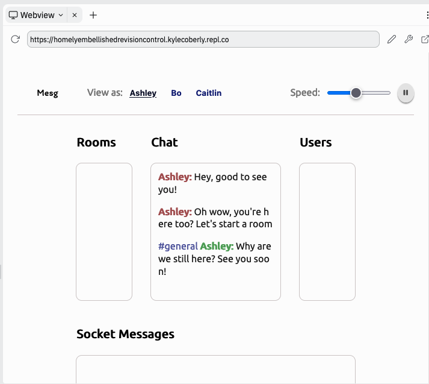
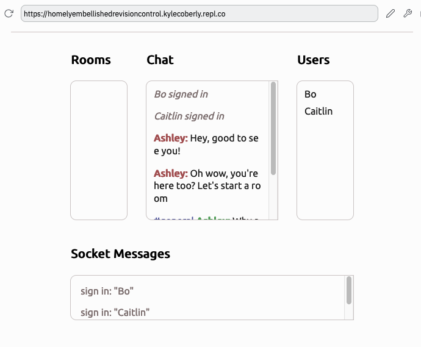
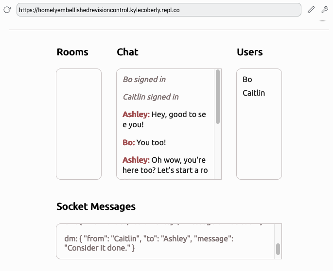
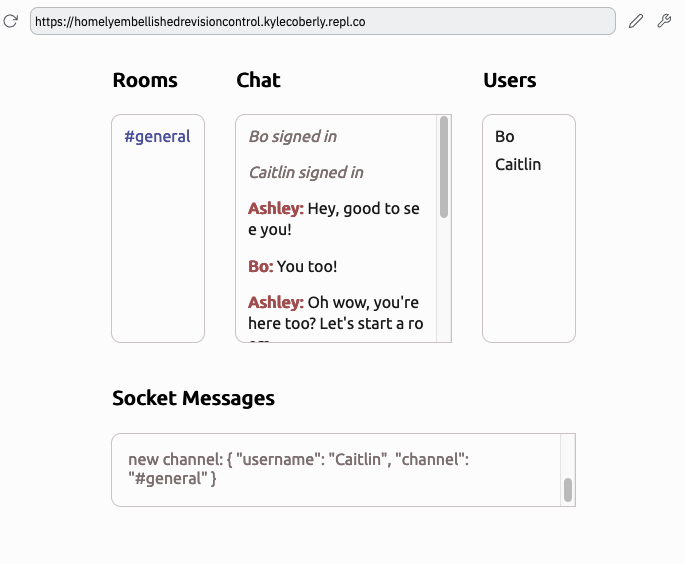
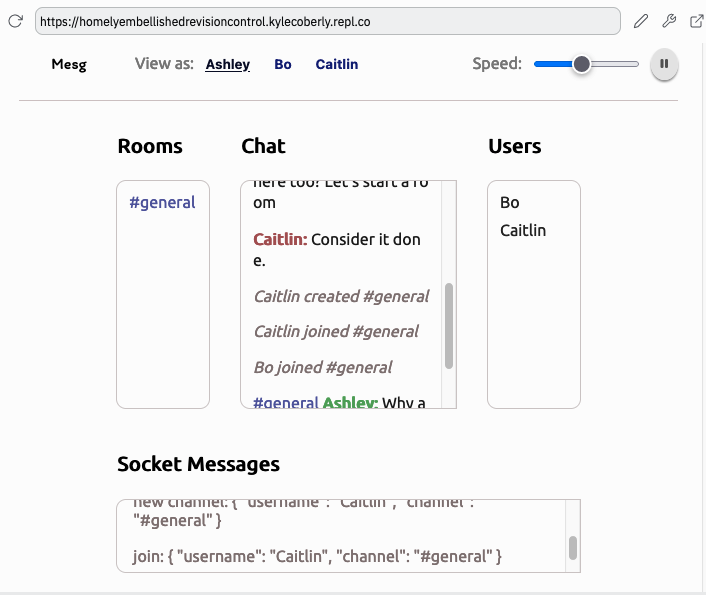
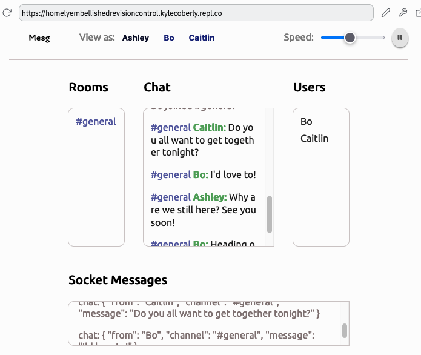
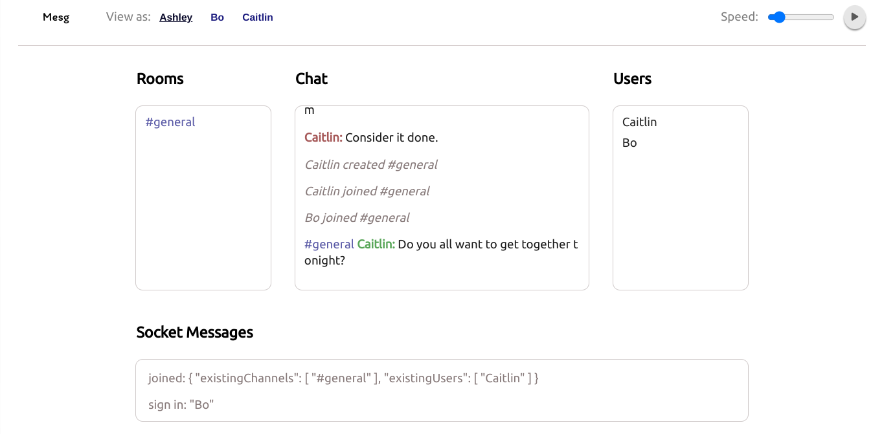

# U5LAB3: Socket Server Lab

## Teacher Notes

This lab has students set up a socket server for a chat room with [Socket.io](https://socket.io/). The front-end and Express server are already set up. The page includes a script that sends Socket.io messages to the server automatically. The exercise involves listening for each socket message and sending the appropriate response.

## Prompt

This lab is about setting up a Socket server for a chat room! The Express server and client are already built, but everything relating to sockets needs to be added by you. This includes:

* Initialization
* Listening For Connections
* Sign In
* DMs
* Channels
* Clean Up

The app includes a script that will automatically send socket messages to your server so you can your progress. Let's get started!

## Directions

All of your work for this lab takes place in [index.js](./U5LAB3-Starter/index.js).

### Initialization

Start by importing Socket.io and the existing Express server. Recall that importing ECMAScript Modules uses the following syntax:

```js
// Example, not solution
import SomeLibraryDefaultExport from "some-library"
import { SomeLibraryNamedExport } from "some-library"

import SomeFileDefaultExport from "./some-file.js"
import { someFileNamedExport } from "./some-file.js"
```

Follow these three steps to initialize your server:

1. **Import the named export `Server` from `"socket.io"`**.
2. **Import the default export from `"./http-server.js"` into a variable called `server`**
3. **Create a new variable named `io` and set it to `new Server(server)`**

If you did this correctly, you should be able to **run `npm start`** and get a notification that your server is listening. You should also have a webview showing the running chat room. You'll use this website to monitor the progress of your socket server. As you add new handlers on the server, you'll see new messages showing up on the page. Right now, you'll see any messages your currently selected user (Ashley by default) is sending but nothing else.

Note that [app.js](./U5LAB3-Starter/app.js) and [http-server.js](./U5LAB3-Starter/http-server.js) contains the rest of the server code, which should look familiar from the Express lab.

If you've done it correctly, it should look like this:



### Listening For Connections

To make your server respond to clients, it first needs to listen for client connections. This looks like this:

```js
io.on("connection", (socket) => {
  // Socket handlers go here
})
```

**Add the code to listen for client connections to `index.js`.**

You'll write all of your socket logic inside this function. This logic is primarily event listeners with handlers that either update something on the server or send messages to clients. For example:

```js
// Example, not solution
let votes = 0

io.on("connection", (socket) => {
  socket.on("vote", (voter) => {
    votes += 1
    socket.broadcast.emit(`${voter} voted!`)
  })
})
```

This code:

* Initializes a vote counter
* Listens for client connections
* When a client connects, an event listener for "vote" is added to its socket
* When this socket sends a "vote" event, the vote counter increments and the voter name that was sent with the event is broadcast to every client except the sender

These two patterns, updating state and sending messages, are powerful enough to implement the rest of the chat room.

## Sign In

Your app already listens for Socket.io connections from clients, but that's a technical detail. Connections don't necessarily contain details about usernames, for example. That kind of thing is an application detail and needs to be handled on its own.

The first thing the handler should do is let everyone else know the sender has logged in. The sender already knows this, so the message should go to everyone but them. This is a really common pattern in socket communications and is called broadcasting. This code listens for any socket to send it a `set price` event and then broadcast that same event to every other socket:

```js
// Example, not solution
// Server
io.on("connection", (socket) => {
  socket.on("set price", (price) => {
    socket.broadcast.emit("set price", price)
  })
})
```

The first argument to `.emit()` is the name of the event and the second can be any data type. That data will be sent to every handler any client has for that event.

```js
// Example, not solution
// One Client
socket.emit("set price", price: 99)

// Every other client
socket.on("set price", (price) => {
  console.log(price) // 99
}
```

**Add an event listener to every socket for the `"sign in"` event.** The handler will be called with a username. **Broadcast the "sign in" event to every other connected client, resending the username.**

If you've done this correctly, you should see sign in messages displaying in the chat log of the website and socket messages starting to display in the socket messages log.



## DMs

While it's possible for two sockets to send messages to each other directly, that's another technical detail that's separate from the application-level concept of sending a direct message. One of the easiest ways to implement direct messaging is to have every user's socket join a room based on their username. That way, anyone else will be able to send messages to the room that has their name.

Rooms are a unique Socket.io feature that allows servers to give a name to an arbitrary groups of sockets. You can think of them in relation to emitting and broadcasting like this:

* Socket emitting: 1
* Room emitting: Some
* Socket broadcasting: All - 1
* Server emitting: All

To add a socket to a room, use `.join()`:

```js
// Example, not solution
socket.join("Some Room")
```

Note that broadcasting and rooms are server-only concepts. Clients are connected to the server but aren't connected to any other clients directly. All clients do is listen for and emit events.

**Inside your existing handler for the `"sign in"` event, add the socket to a room based on the given user.**

To send a message to a room, put `.to("room name")` before the `.emit()`:

```js
// Example, not solution
socket.to("socket club").emit("chat", "Let's get real-time!");
```

**Create a new socket handler for the `"dm"` event.** The handler will be called with a message object. **Send a `"dm"` event to the room in the `.to` property of the message, resending the entire message object with it.**

If you did all of this correctly, you should see DMs starting to display in the chat log of the app and new socket messages displaying. Take a moment to examine the structure of the data in the DM objects.



## Channels

Much like connecting/signing on and socket messaging/DMing are distinct technical vs. application concepts, Socket.io rooms are a technical companion to the chat room concept of channels. Clients will send a `"new message"` event with details about the new room. In production servers, creating a room ordinarily involves additional server work such as adding it to a database. These kinds of operations may or may not succeed, so it makes sense to send this message to every socket--including the sender. To send a message to the entire server, use `io.emit()`:

```js
// Example, not solution
io.on("connection", (socket) => {
  socket.on("announce", (announcement) => {
    io.emit(`Attention everyone: ${announcement}`)
  })
})
```

Note that entire server (`io`) is emitting, _not_ an individual `socket`.

**Listen for the `new channel` event.** The handler will be called with an object representing the channel. **Emit a `new channel` event to every connect client, sending the channel object with it.**

If you do this correctly, the `#general` channel should start showing up under the Rooms log.



Clients will also send `"join"` events to the server to request to join a room.

**Listen for the `"join"` event.** The handler will be called with an object representing the join request. Its `.channel` property contains a channel name. **Use the channel name to add the socket to the appropriate Socket.io room. Then, broadcast a `"join"` event to every socket beside the sender, resending the entire join request.**



Clients will send `"chat"` events to the server to send a message to a room. Note that this is distinct from `"dm"` events.

**Listen for `"chat"` events.** The handler will be called with an object representing the chat message. Its `.channel` property contains a channel name. **Use the channel name to emit a `"chat" message to the appropriate Socket.io room, resending the entire message object.**

If you did this correctly, you should see channel messages appear in the chat log and additional socket messages display as well.



## Clean Up

The last step is to end the socket connection, freeing up resources for the server. To do this, use the `.disconnect` method on the socket:

```js
// Example, not solution
socket.disconnect();
```

**Listen for "sign out" events on every socket. Disconnect the socket in the handler.**

## Exemplar



## Culturally Responsive Best Practices

* If the students are unfamiliar with chat rooms, show them some examples relevant to them, such as Facebook Messenger, Discord, Slack, or even chat bots from commercial websites. You may want to show them historical examples, such as AOL instant messenger, ICQ, or IRC. You may wish to compare/contrast these tools with contemporary methods of online communication.
* You may wish to talk about the concept of online identities as being distinct from real identities, and how screen names have helped people from marginalized groups protect themselves while still establishing a consistent presence and engaging in a community. Conversely, discuss how how people have used this kind of anonymity to hurt others without consequences. This app doesn't do anything to permanently register or protect screen names. You may want to lead a discussion on what the server would have to do to prevent someone from impersonating you, or how difficult it to tell whether the server is logging or sharing your messages with others.

## Extra Help

* [**Socket.io**](https://socket.io/)
* [**Socket.io Guide**](https://socket.io/docs/v4/)
* [**Socket.io Official Emit Cheatsheet**](https://socket.io/docs/v4/emit-cheatsheet/)
* [**Socket.io Server API**](https://socket.io/docs/v4/server-api/)

### Socket.io Quick Reference

These send a message from the server to one or more connected clients:

| Method | Recipient |
| --- | --- |
| `socket.emit("some event", "Some value")` | Sender |
| `socket.to("some room").emit("some event", "Some value")` | Everyone in a room |
| `socket.broadcast.emit("sign on", "Some value")` | Everyone except sender |
| `io.emit("some event", "Some value")` | Everyone (note the `io`) |

These change something about the socket:

| Method | What it does |
| --- | --- |
| `socket.join("some room")` | Join a room |
| `socket.leave("some room")` | Leave a room |
| `socket.disconnect()` | Close a socket connection |

## Extensions

### Mild

* In the `"sign out"` event handler, broadcast a `"sign out"` message and resend the data
* Add an event handler for the `"leave"` event. This should broadcast as a `"leave"` event and send the leave request data. Additionally, the socket should leave the channel stored in the `.channel` property of the leave request.

### Medium

Right now, the server can't tell you which channels and users already existed when you signed on. The `Set` data type is useful for things like this. Sets are similar to arrays, but every item is guaranteed to be unique. If you try to add something to a Set that already exists, nothing will change. Sets are created with the `new` keyword:

```js
// Example, not solution
const someSet = new Set()
```

**Create 2 empty Sets for users and channels. These should be created outside of the `"connection"` event handler.**

To add data to a set, call its `.add()` method. To remove data, use its `.delete()` method.

```js
// Example, not solution
const someSet = new Set() // Set is empty
someSet.add("Some Item") // Set has 1 item
someSet.add("Another Item") // Set has 2 items
someSet.add("Some Item") // Doesn't do anything, already exists
someSet.delete("Some Item") // Set has 1 item again
```

**In the `"sign in"` event handler, add the user to the users Set. In the `"new channel"` event handler, add the channel name to the channels Set. Note that the channel name is in the `.channel` property of the new channel request object.**

Finally, let the new client know what the current rooms and users are when they sign on. Sets are similar to arrays, but not identical and need to be converted to arrays before they can be emitted. The easiest way to convert a Set to an array is to spread it into one:

```js
// Example, not solution
const someSet = new Set()
const someArray = [...someSet]
```

**In the `"sign in"` event handler, emit a `"joined"` event back to the original sender. Send an object with `existingChannels` and `existingUsers` properties. These properties should be set to the array versions of your users and channels Sets.**

### Spicy

Explore [client/actions.js](./U5LAB3-Starter/client/actions.js). Read through the `actions` array to understand the format of the chat script. Modify the `actions` array to be a chat script of your own.

## Reflection Questions

* Why does each socket event listener go inside the connection handler?
* Why don't clients know what rooms their socket is in?
* Why is at least one advantage to broadcasting vs. sending the message to the entire channel?
* Why is emitting to every socket done on `io` while emitting to other groups of sockets is done on `socket`?
